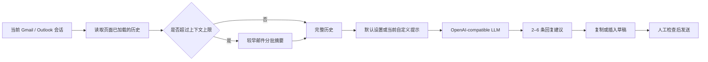

<div align="center">

# Smart Email Reply

### Read the thread. Understand the context. Draft the right reply.
### 读取邮件历史，理解上下文，生成真正能用的回复。

[](https://developer.chrome.com/docs/extensions/develop/migrate/what-is-mv3)
[](./manifest.json)
[](#支持范围)
[](#支持范围)
[](#配置-llm-api)

**[中文](#中文说明) · [English](#english-guide) · [Privacy](#privacy--data-flow)**

</div>

---

## 中文说明

Smart Email Reply 是一个 Chrome / Edge 原生侧边栏扩展。它读取当前 Gmail 或 Outlook Web 页面中已经加载的邮件会话历史，结合你配置的 LLM API，生成 2–6 条可选择的回复草稿。

它不需要 Gmail API、Microsoft Graph、Client ID、Tenant 或邮箱 OAuth，也不会自动发送邮件。

### 为什么做这个插件？

普通 AI 写信工具往往只看到最后一封邮件；真正棘手的回复却依赖之前谈过什么、对方答应过什么、哪些问题还没解决。Smart Email Reply 会先读取当前页面中可见和已加载的完整会话，再生成更贴合上下文的回复。

### 功能亮点

| 功能 | 说明 |
| --- | --- |
| 📚 当前会话历史 | 读取当前 Gmail / Outlook 页面已经加载的全部历史正文 |
| 🧠 长对话处理 | 超出上下文上限时，分批摘要较早邮件，保留最近消息全文 |
| ✨ 多条回复建议 | 一次生成 2–6 条不同语气或策略的完整邮件 |
| 🎯 自定义提示 | 输入当前要求，例如“英文礼貌追问进度，控制在 100 词以内” |
| 🧩 标签页独立 | 每个标签页拥有独立侧边栏实例，状态和生成结果互不覆盖 |
| 📋 复制 / 插入草稿 | 可复制建议，或插入当前回复编辑框；始终由用户确认并发送 |
| 🔌 自定义 LLM | 支持 OpenAI-compatible `chat/completions` API、模型和鉴权头 |
| 🛡️ 格式保护 | 自动恢复部分截断 JSON，并阻止原始模型 JSON 被插入草稿 |

### 工作流程



### 安装

#### 方法一：下载仓库

1. 在 GitHub 点击 **Code → Download ZIP**，解压到本地。
2. Chrome 打开 `chrome://extensions`；Edge 打开 `edge://extensions`。
3. 开启右上角的 **开发者模式 / Developer mode**。
4. 点击 **加载已解压的扩展程序 / Load unpacked**。
5. 选择包含 `manifest.json` 的仓库根目录。
6. 刷新已经打开的 Gmail / Outlook 页面。

#### 方法二：Git 克隆

```bash
git clone https://github.com/Marverlises/Smart-Email-Agent.git
```

然后在扩展管理页加载克隆得到的 `Smart-Email-Agent` 文件夹。

### 配置 LLM API

1. 在 Gmail / Outlook 页面点击 Smart Email Reply 图标。
2. 点击侧边栏右上角的 **⚙ 设置**。
3. 填写 API 基础地址、模型名称和 API Key（本地模型或无需鉴权的服务可留空）。
4. 如有需要，展开“高级鉴权”修改请求头和 Key 前缀。
5. 点击 **测试连接**，成功后保存设置。

> API 地址既可以是 `/v1` 一类基础地址，也可以直接填写完整的 `/chat/completions` 地址。扩展会按需申请对应 API 域名权限。

### 在浏览器中怎么用？

1. 在 Gmail 或 Outlook Web 打开一封具体邮件会话。
2. 点击浏览器工具栏中的 Smart Email Reply 图标。
3. 侧边栏会显示平台、主题和识别到的历史邮件 / 正文块数量。
4. 选择一种生成方式：
   - **根据全部历史生成回复**：自动回复最新来信。
   - **按我的提示生成**：输入当前要求，再点击“根据提示生成”。
5. 从多条建议中选择 **复制** 或 **插入草稿**。
6. 检查姓名、日期、金额、承诺、收件人和附件后，手动发送。

自定义提示示例：

```text
结合过往对话，用英文礼貌追问申请进度，并询问预计回复时间，控制在 100 词以内。
```

```text
对方已经同意延期。请生成一封简短确认邮件，明确新的截止日期和我下一步会提交的材料。
```

```text
根据历史内容，只追问尚未解决的两个问题，语气专业但不要过度客套。
```

输入框支持 `Ctrl + Enter`；macOS 支持 `Command + Enter`。

### 支持范围

- `https://mail.google.com/*`
- `https://outlook.office.com/*`
- `https://outlook.live.com/*`
- `https://outlook.cloud.microsoft/*`
- Chrome 116+
- 基于 Chromium 且支持 Chrome Side Panel API 的新版 Edge

### Privacy & Data Flow

扩展只读取当前页面已经加载到 DOM 的邮件会话，不会访问整个邮箱，也不会跨其他线程搜索。

生成时，以下内容会发送到你配置的 LLM 服务：

- 当前会话中的发件人、收件人、时间、主题和正文
- 长会话产生的中间摘要
- 当前页面标题、生成偏好和你输入的自定义提示

API 地址、模型、API Key 和生成偏好保存在浏览器扩展本地存储中，但并非操作系统级加密保险库。请根据邮件敏感程度选择组织批准的 LLM 服务，并阅读服务商的数据保留政策。

扩展不会：

- 请求 Gmail / Outlook OAuth
- 自动发送、删除或修改邮件
- 执行模型返回的 HTML 或脚本
- 将未解析的原始回复 JSON 插入草稿

更多信息请阅读 [PRIVACY.md](./PRIVACY.md)。

### 长会话与已知限制

- 扩展只能读取邮箱页面已经加载的内容；尚未加载、加密或跨线程的邮件无法获取。
- Gmail 和 Outlook 会不定期修改页面结构。识别异常时，请展开折叠邮件并点击“重新读取”。
- Outlook 可能把多封引用邮件合并成一个正文块。扩展会尝试按 `From / Sent / To / Subject` 及中文同类字段拆分；无法可靠拆分时仍会把整个正文块作为上下文。
- LLM 可能犯错。发送前必须人工检查重要事实与承诺。

### 项目结构

```text
Smart-Email-Agent/
├── manifest.json          # Chrome Manifest V3
├── background.js          # Side Panel、LLM 请求、长会话摘要和输出解析
├── content.js             # Gmail / Outlook 会话提取与草稿插入
├── sidepanel.*            # 标签页独立的侧边栏界面
├── options.*              # LLM API 和生成偏好设置
├── PRIVACY.md             # 隐私与数据流说明
└── TESTING.md             # 手工测试清单
```

### 本地验证

```powershell
node --check background.js
node --check content.js
node --check sidepanel.js
node --check options.js
```

完整的浏览器测试项目请见 [TESTING.md](./TESTING.md)。

---

## English Guide

Smart Email Reply is a native Chrome / Edge side-panel extension that reads the email conversation already loaded in the current Gmail or Outlook Web page and uses your own OpenAI-compatible LLM API to generate 2–6 selectable drafts.

No Gmail API, Microsoft Graph, Client ID, Tenant, or mailbox OAuth is required. The extension never sends email automatically.

### Why this project?

Most AI writing tools see only the latest email. Real replies often depend on earlier promises, preferences, decisions, and unresolved questions. Smart Email Reply reads the loaded thread first, summarizes older content when necessary, and then drafts replies with the full context in mind.

### Highlights

| Feature | What it does |
| --- | --- |
| Current-thread context | Reads the email bodies already loaded in the active Gmail / Outlook thread |
| Long-thread support | Summarizes older messages in batches while keeping recent messages in detail |
| Multiple options | Produces 2–6 complete drafts with meaningfully different approaches |
| Custom instruction | Combines the full thread with your current purpose, tone, language, or length request |
| Per-tab isolation | Each browser tab receives its own side-panel instance and state |
| Copy or insert | Copies a suggestion or inserts it into the current composer for manual review |
| Configurable LLM | Works with OpenAI-compatible `chat/completions` endpoints and custom auth headers |
| Output safeguards | Recovers complete objects from truncated JSON and blocks raw JSON insertion |

### Installation

1. Download and unzip this repository, or run:

   ```bash
   git clone https://github.com/Marverlises/Smart-Email-Agent.git
   ```

2. Open `chrome://extensions` in Chrome or `edge://extensions` in Edge.
3. Enable **Developer mode**.
4. Click **Load unpacked** and select the repository root containing `manifest.json`.
5. Refresh any Gmail or Outlook tabs that were already open.

### Configure your LLM

1. Open the extension side panel and click the **⚙ settings** button.
2. Enter the API base URL or full `chat/completions` endpoint, model name, and API key.
3. Adjust the number of suggestions, output language, tone, temperature, and context limits if needed.
4. Click **Test connection**, then save.

### Use it in the browser

1. Open a specific Gmail or Outlook Web conversation.
2. Click the Smart Email Reply toolbar icon.
3. Review the detected platform, subject, and history count.
4. Choose either:
   - **Generate from full history** for a normal reply to the latest incoming message.
   - **Generate from my prompt** to combine the full thread with a specific current instruction.
5. Copy a suggestion or insert it into the composer.
6. Verify all facts and send the email manually.

Example custom instruction:

```text
Using the full conversation, write a polite English follow-up asking about the application timeline. Keep it under 100 words.
```

Use `Ctrl + Enter` (`Command + Enter` on macOS) to generate from the custom-instruction box.

### Privacy

Only the conversation already loaded in the current page is read. The thread content, intermediate summaries, page title, generation preferences, and custom instruction are sent to the LLM endpoint you configure.

The extension does not access the full mailbox, use mailbox OAuth, search other threads, or send/delete email. API settings are stored in browser extension storage, which is not an operating-system encrypted vault. Use an approved LLM provider for sensitive email.

See [PRIVACY.md](./PRIVACY.md) for details.

### Limitations

- Content that the webmail page has not loaded cannot be read.
- Webmail DOM structures can change; refresh the page and use **Read again** if extraction looks wrong.
- Quoted Outlook chains may be represented as a single body block. The extension attempts to split standard quoted headers and otherwise retains the entire block as context.
- LLM output can be wrong. Always review recipients, names, dates, amounts, commitments, and attachments before sending.

### Contributing

Issues and pull requests are welcome. When changing extraction logic, test both single-message and multi-message threads in Gmail and Outlook Web, and verify that the extension never sends an email automatically.

---

<div align="center">

Built for people who spend too much time reconstructing context before replying.

**The final send button always belongs to you.**

</div>
